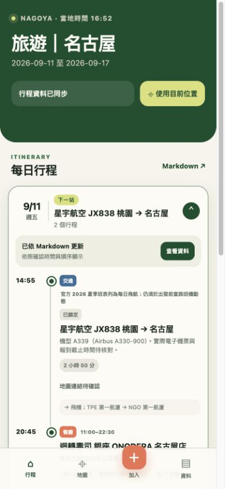

# Nagoya Trip 2026

iPhone-first travel PWA generated from one Markdown source of truth.



## Data workflow

Edit [`nagoya-trip.md`](./nagoya-trip.md), then rebuild the site. It contains trip settings, daily itinerary, place records, transport segments, unresolved items, and an update log. The application does not maintain a second hand-edited itinerary dataset.

```bash
npm test
npm run build
npm run serve
```

Open <http://localhost:4173> after running the server. The deployable static output is written to `dist/`.

## iPhone installation

1. Open the deployed HTTPS URL in Safari.
2. Tap Share.
3. Choose Add to Home Screen.
4. Open 名古屋行程 from the Home Screen.

Location is requested only after tapping `使用目前位置`. When a place has coordinates, the UI shows straight-line metric distance alongside the route estimate recorded in Markdown.

## Updating the trip

1. Add or revise a place in `nagoya-trip.md`.
2. Keep confirmed or reserved times marked `時間是否鎖定：是`.
3. Run `npm test && npm run build`.
4. Commit the Markdown and regenerated site source together.

## Icon attribution

The map-pin glyph is from [Lucide](https://lucide.dev/) via Iconify and is used under the ISC license. The enclosing application artwork is project-specific.
